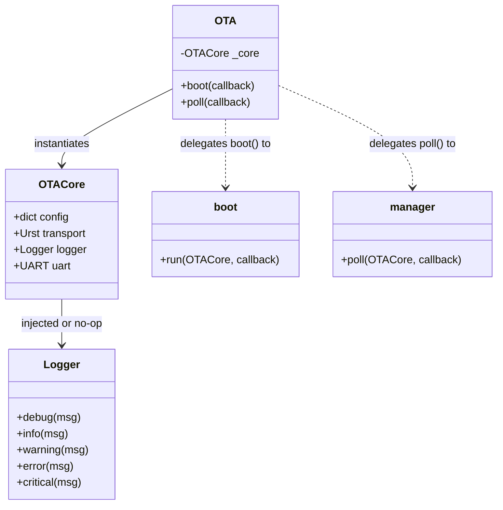

# Architecture Documentation

This document describes the design and software architecture of **OTAmpy** — a reliable, over-the-air (OTA) application update and command interface for MicroPython devices via serial/wireless transports (e.g., XBee modules).

---

## High-Level Architecture Overview

OTAmpy is structured as a monorepo containing two primary packages:

```
otampy/
├── packages/
│   ├── cli/       # Python-based Host Command Line Interface (CPython)
│   └── device/    # MicroPython libraries and update engine (runs on device)
```

The host CLI talks to the device over a serial interface running the **Universal Reliable Serial Transport (URST)** protocol.

---

## Device-Side Architecture (Composition & Facade)

To fit inside resource-constrained microcontrollers (like the Raspberry Pi Pico W) while maintaining a clean, DRY (Don't Repeat Yourself) design, the device code is structured around the **Facade** and **Composition** design patterns.

### Component Relationship

The library splits the shared setup/state from the specific execution control flows (boot-time updates vs. runtime loop polling):



### Module Responsibilities

| File         | Module/Class           | Description                                                                                                  |
| ------------ | ---------------------- | ------------------------------------------------------------------------------------------------------------ |
| `ota.py`     | `OTA`                  | The public **Facade** class. Exposes a simple interface to developers.                                       |
| `core.py`    | `OTACore`              | Shared state container. Handles UART/URST wrapping, default configuration setups, and logger initialization. |
| `boot.py`    | `run(core, callback)`  | Linear boot-time logic. Checks for the update flag, runs the updater callback, and cleans up the flag.       |
| `manager.py` | `poll(core, callback)` | Run-time polling function. Periodically inspects serial transport for command payloads and dispatches them.  |

Applications may inject any logger with the methods shown above. If they do
not, `OTACore` uses the allocation-light `NullLogger`. The example application
selects the optional `log-to-file` logger when installed and otherwise remains
silent.

---

## Integration Guide

Integrating OTAmpy into a MicroPython device requires simple configuration and imports.

### 1. Device Configuration (`config.py`)

Place a `config.py` in the root of the device directory containing UART connection settings:

```python
LOG_LEVEL = "DEBUG"
LOG_FILE = "/ota.log"
OTA_PORT = 1
OTA_TX_PIN = 4
OTA_RX_PIN = 5
OTA_BAUDRATE = 57600
UPDATE_REQUEST_FLAG_FILE = "update_requested.flag"
```

### 2. Boot-Time Updates (`boot.py`)

During microcontroller boot, check for pending update requests before starting the main application:

```python
import config
from machine import UART, Pin
from otampy import OTA

# Initialize UART
uart = UART(
    config.OTA_PORT,
    baudrate=config.OTA_BAUDRATE,
    tx=Pin(config.OTA_TX_PIN),
    rx=Pin(config.OTA_RX_PIN),
)

# Run boot checker (non-blocking if no update requested)
OTA(uart, config=config).boot()
```

### 3. Application Main Loop (`main.py`)

In the application's runtime loop, run `.poll()` periodically to process remote commands from the host CLI:

```python
import config
import time
from machine import UART, Pin
from otampy import OTA

uart = UART(
    config.OTA_PORT,
    baudrate=config.OTA_BAUDRATE,
    tx=Pin(config.OTA_TX_PIN),
    rx=Pin(config.OTA_RX_PIN),
)

ota = OTA(uart, config=config)

while True:
    # 1. Do application tasks
    read_sensors()

    # 2. Periodically poll for OTA CLI commands
    ota.poll()

    time.sleep(0.1)
```

---

## Test Environment Architecture

Since both the CLI package (`packages/cli`) and the device package (`packages/device`) share the package namespace `otampy`, global test suites (e.g., executing `pytest` at the repository root) could clash within the python `sys.modules` cache.

To achieve complete test isolation:

- `packages/device/tests/conftest.py` runs before the device test modules are collected.
- It dynamically loads the device library into python under the virtual name **`device_otampy`**.
- This registers all device-side code (e.g., `device_otampy.ota`, `device_otampy.core`) independently, leaving the `otampy` namespace clear for the CPython host CLI package.
