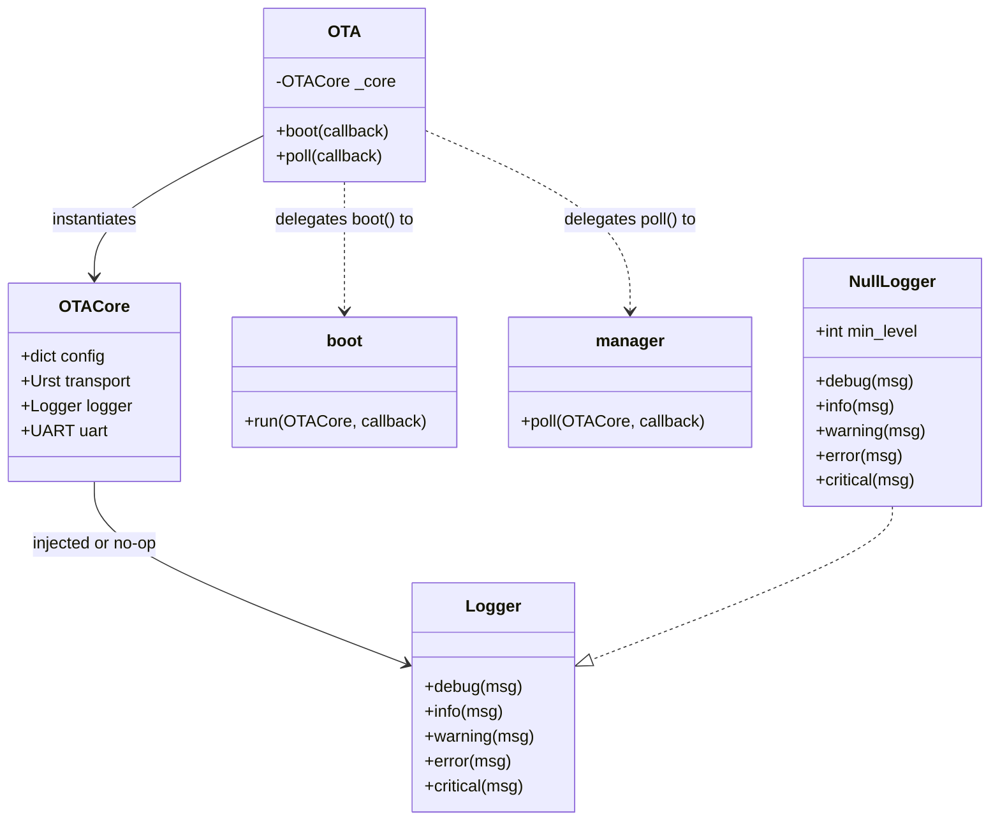

# Architecture Documentation

This document describes the design and software architecture of **OTAmpy** — a reliable, over-the-air (OTA) application update and command interface for MicroPython devices via serial/wireless transports (e.g., XBee modules).

---

## High-Level Architecture Overview

OTAmpy is structured as a monorepo containing two primary src:

```
otampy/
└── src/otampy/        # Host CLI package (Python >= 3.12)
    ├── cli.py         # Click-based command-line interface
    ├── deploy.py      # Deploy command implementation
    └── device/        # MicroPython device library & update engine (runs on device)
```

The host CLI talks to the device over a serial interface running the **Universal Reliable Serial Transport (URST)** protocol.

---

## Device-Side Architecture (Composition & Facade)

To fit inside resource-constrained microcontrollers (like the Raspberry Pi Pico W) while maintaining a clean, DRY (Don't Repeat Yourself) design, the device code is structured around the **Facade** and **Composition** design patterns.

### Component Relationship

The library splits the shared setup/state from the specific execution control flows (boot-time updates vs. runtime loop polling):


```mermaid
classDiagram
    class OTA {
        -OTACore _core
        +boot(callback)
        +poll(callback)
    }

    class OTACore {
        +dict config
        +Urst transport
        +Logger logger
        +UART uart
    }

    class boot {
        +run(OTACore, callback)
    }

    class manager {
        +poll(OTACore, callback)
    }

    class Logger {
        +debug(msg)
        +info(msg)
        +warning(msg)
        +error(msg)
        +critical(msg)
    }

    class NullLogger {
        +int min_level
        +debug(msg)
        +info(msg)
        +warning(msg)
        +error(msg)
        +critical(msg)
    }

    OTA --> OTACore : instantiates
    OTA ..> boot : delegates boot() to
    OTA ..> manager : delegates poll() to
    OTACore --> Logger : injected or no-op
    NullLogger ..|> Logger
```

### Module Responsibilities

| File          | Module/Class            | Description                                                                                                  |
| ------------- | ----------------------- | ------------------------------------------------------------------------------------------------------------ |
| `ota.py`      | `OTA`                   | The public **Facade** class. Exposes a simple interface to developers.                                       |
| `core.py`     | `OTACore`               | Shared state container. Handles UART/URST wrapping, default configuration setups, and logger initialization. |
| `boot.py`     | `run(core, callback)`   | Linear boot-time logic. Checks for the update flag, runs the updater callback, and cleans up the flag.       |
| `manager.py`  | `poll(core, callback)`  | Run-time polling function. Dispatches commands and lazily delegates copy transfers.                          |
| `filecopy.py` | `handle(core, command)` | Lazily loaded staged, checksum-verified runtime copy state machine.                                          |

Applications may inject any logger with the methods shown above. If they do
not, `OTACore` uses the allocation-light `NullLogger`. The example application
selects the optional `log-to-file` logger when installed and otherwise remains
silent. OTAmpy does not import a file-logging module in the production profile.
Runtime copies retain a flat transfer state on `OTACore` only while a copy is
active; file content is written and hashed in bounded chunks rather than held
in RAM.
The host CLI preserves the remote recovery control plane by rejecting a
complete removal selection before sending its first `RM`.
It also rejects arguments matching host filesystem entries unless explicitly
marked as intentional remote path names; no RM path invokes a host deletion
operation.

---

## Integration Guide

Integrating OTAmpy into a MicroPython device requires simple configuration and imports.

### 1. Device Configuration (`configota.py`)

Place a `configota.py` in the root of the device directory containing UART
connection settings. The logger settings are used by the deployed examples
only when the optional `log-to-file` package is installed:

```python
LOG_LEVEL = "DEBUG"
LOG_FILE = "/ota.log"
LOG_MAX_BYTES = 10240
LOG_BACKUP_COUNT = 1
LOG_USE_TICKS = False
OTA_PORT = 1
OTA_TX_PIN = 4
OTA_RX_PIN = 5
OTA_BAUDRATE = 57600
OTA_TIMEOUT_MS = 5000
UPDATE_REQUEST_FLAG_FILE = "update_requested.flag"
OTA_JOURNAL_FILE = "otampy-update.journal"
OTA_TRIAL_BOOTS = 3
OTA_BOOT_LISTEN_MS = 1000
```

`OTA_JOURNAL_FILE` (default `otampy-update.journal`, at the filesystem root)
is the retain-previous commit journal. It must be a dedicated scratch path,
never a real source file — a commit clobbers what it points at.

`OTA_TRIAL_BOOTS` (default `3`) is how many boots into an unconfirmed update
candidate the device tolerates before it auto-restores the previous
generation. See "Trial boot" below.

`OTA_BOOT_LISTEN_MS` (default `1000`) is how long `boot.py` listens for a
recovery command on any boot with no update pending. It is added to every such
boot — ~1 s at the default, plus one `Urst` transport instantiation — and is
paid on each iteration of a boot-loop too. `0` disables the window entirely,
which also removes the only recovery path for a device stranded before
`main.py`. A non-integer value falls back to the default; `<= 0` disables. See
"Trial boot" below.

### 2. Boot-Time Updates (`boot.py`)

During microcontroller boot, check for pending update requests before starting the main application:

```python
import config
from machine import UART, Pin
from otampy import OTA

# Initialize UART
uart = UART(
    config.OTA_PORT,
    baudrate=config.OTA_BAUDRATE,
    tx=Pin(config.OTA_TX_PIN),
    rx=Pin(config.OTA_RX_PIN),
)

# Run boot checker (non-blocking if no update requested)
OTA(uart, config=config).boot()
```

`OTA.boot(callback)` calls the callback with the update-request flag path when
an update is pending. Zero-argument callbacks remain supported for backwards
compatibility.

When an update is pending, boot mode accepts `UPDATE_ABORT` and automatically
abandons an inactive transfer after `OTA_TIMEOUT_MS`. Both paths delete staged
`.ota` files, clear the request flag, and continue into the current application.

`UPDATE_COMMIT` is all-or-nothing and retains the previous generation. It writes
`OTA_JOURNAL_FILE` with a `committing` marker, renames each target to
`<target>.bck` and the staged `.ota` into place, then flips the marker to `0`.
A failed rename rolls the whole set back from `.bck` (`COMMIT_ERR`); a power loss
mid-commit is finished or reversed by `restore.repair()`, which `boot.run()`
calls on every boot before the flag check. `UPDATE_START` discards the previously
retained generation, so at most one is kept. Recovery is best-effort over
reboots, not a power-loss-atomic filesystem transaction; a hard guarantee needs
a dual-slot layout.

Because the interrupted file can be `boot.py` itself — leaving no `boot.py` to
run `boot.run()` — the shipped `main.py` scaffold also calls `OTA(...).recover()`
once at startup, which runs the same `repair()`. `commit()` renames one file at
a time, so at most one of `boot.py`/`main.py` is ever absent and the survivor
restores the set. A custom `main.py` should keep that call.

#### Trial boot, confirmation, and auto-restore

`COMMIT_OK` does not make an update permanent. The committed candidate is on
trial: `boot.run()` calls `restore.trial()` on every boot, which increments
the journal's boot counter. Once the counter passes `OTA_TRIAL_BOOTS` the
device runs `restore.restore_all()` — the whole previous generation renamed
back from `.bck`, journal removed — and `machine.reset()`s onto it, with no
host involvement.

The auto-restore trigger is **a reboot during the trial window** — a crash,
panic, brownout, watchdog, or manual power cycle. A candidate that hangs
without resetting is not auto-restored; the application is expected to run its
own watchdog to supply the reset (as `diff-drive-robot` does).

The candidate leaves trial when the host sends `CONFIRM` (`otampy upd` does
this after a post-reboot `PING` unless `--no-confirm`) or the application
calls `ota.confirm()` after its own health check. Confirming flips the
journal to `confirmed` and only stops the counter — the retained `.bck` set
is kept until the next update's `UPDATE_START`, so the previous generation
stays recoverable. A plain power cycle never rolls back a confirmed
candidate.

Because the `.bck` set survives confirmation, a healthy-looking-but-wrong
update can still be reverted over the radio: `otampy rollback` sends the
channel-0 `ROLLBACK` command, `manager.poll` runs `restore.rollback()` (the
whole retained generation renamed back, journal removed), replies, and
`machine.reset()`s onto the previous version. It refuses without resetting
when nothing is retained or a commit is mid-flight. `ROLLBACK` is served by the
`main.py` poll loop and — for a device stranded before that point — by the
boot-time recovery window (below). Only one generation is retained, so rollback
is one-shot: what it lands on has no `.bck` and cannot be rolled back again.

`boot.run()` opens a short **recovery window** on every boot where
`UPDATE_REQUEST_FLAG_FILE` is absent, after `repair()`/`trial()` have healed
the tree. For `OTA_BOOT_LISTEN_MS` (default `1000`) it listens on channel 0
for exactly two commands — `UPDATE_REQUEST` (write the flag and reset into a
normal update session) and `ROLLBACK` (revert to the retained generation) —
answering everything else, `PING` included, with `ERROR:Recovery window`. It
is the recovery path for a candidate that was confirmed and then proved fatal,
or one that hangs before `ota.poll()` is reached. The window is silent (no
beacon — an unacknowledged `Urst.send()` would cost up to ~8 s per boot), so
the host blind-retries: `otampy upd --recover` and `otampy rollback --recover`
prompt the operator to power-cycle and keep retrying for `recovery-wait`
seconds (default `60`) until a command lands in a window. When
`OTA_REQUIRE_AUTH` is set the window enforces the same `AUTH:` envelope as the
runtime surface — it is not a bypass. It needs `boot.py` itself to run;
a `boot.py` that crashes earlier, or a wedged UART, still requires USB.
`docs/protocol.md` §2.4 has the full dispatch table.

Nothing arms a watchdog this early (`boot.run()` precedes `main.py`) and
1000 ms is far under the RP2040's ~8388 ms cap. A custom `boot.py` that arms a
watchdog *before* `OTA(...).boot()` must keep `OTA_BOOT_LISTEN_MS` under its
period. An integrator whose hardware needs attention sooner than ~1 s into
boot (motor control, say) should note the window runs with no application and
no watchdog for that duration.

Pass the same injected logger to `OTA` in both scripts if the application
wants logging. Omitting it selects `NullLogger`.

### 3. Application Main Loop (`main.py`)

In the application's runtime loop, run `.poll()` periodically to process remote commands from the host CLI:

```python
import config
import time
from machine import UART, Pin
from otampy import OTA

uart = UART(
    config.OTA_PORT,
    baudrate=config.OTA_BAUDRATE,
    tx=Pin(config.OTA_TX_PIN),
    rx=Pin(config.OTA_RX_PIN),
)

ota = OTA(uart, config=config)

while True:
    # 1. Do application tasks
    read_sensors()

    # 2. Periodically poll for OTA CLI commands
    ota.poll()

    time.sleep(0.1)
```

### 4. Sharing the UART with application code

The examples above are **direct mode**: OTA owns the raw UART. If your
application needs the *same* physical UART (a control/telemetry stream over
one radio link), scaffold the shared-UART set with `otampy init --mux`
instead. Its `boot.py`/`main.py` wrap the UART in `otampy.mux.SerialMux`,
giving OTA and the application isolated channels, and the host CLI must then
run with `--mux` (or `otampy mux --enable`) to speak the matching outer
frame. This is a deliberate two-sided choice — a one-sided mismatch times out
silently. See `docs/protocol.md` §1.1 and §1.3.

---

## Test Environment Architecture

Since both the CLI package (`src/otampy`) and the device package (`src/otampy/device`) share the package namespace `otampy`, global test suites (e.g., executing `pytest` at the repository root) could clash within the python `sys.modules` cache.

To achieve complete test isolation:

- `src/otampy/device/tests/conftest.py` runs before the device test modules are collected.
- It dynamically loads the device library into python under the virtual name **`device_otampy`**.
- This registers all device-side code (e.g., `device_otampy.ota`, `device_otampy.core`) independently, leaving the `otampy` namespace clear for the CPython host CLI package.
